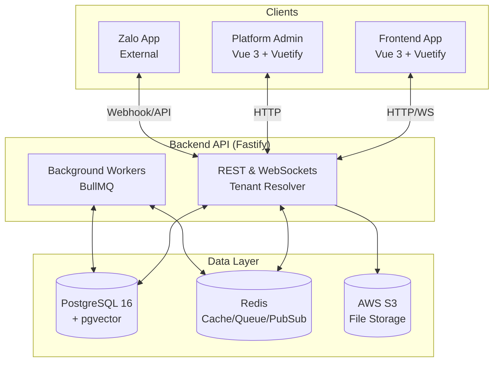
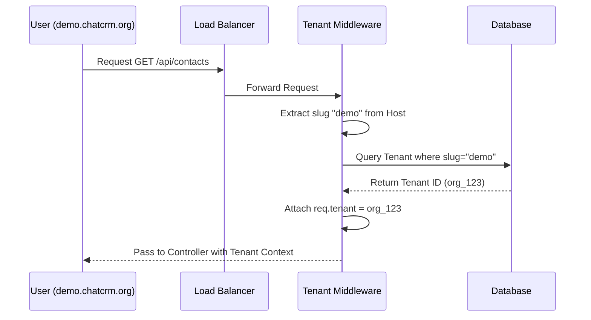
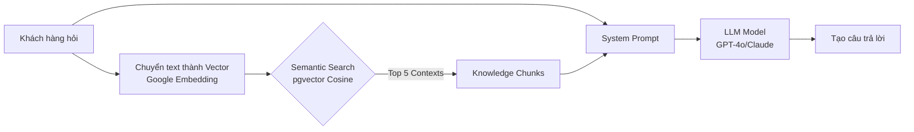

# Kiến trúc Hệ thống Chat Multi CRM

Tài liệu này mô tả toàn bộ kiến trúc kỹ thuật của dự án Chat Multi CRM, bao gồm cấu trúc các thành phần, luồng dữ liệu và chi tiết về cách thức hoạt động của mô hình Multi-tenant (Đa người thuê).

---

## 1. Kiến trúc Tổng thể (High-level Architecture)

Dự án được xây dựng theo mô hình **Monolithic Modulith** (Nguyên khối theo module) cho Backend, kết hợp với kiến trúc **SPA** (Single Page Application) cho các Frontend.

### Các thành phần chính:



1. **Frontend App (`/frontend`)**:
   - Dành cho người dùng cuối (Nhân viên, Quản lý của các tổ chức/công ty).
   - Công nghệ: Vue 3 (Composition API), Vite, Vuetify 4, Pinia, Socket.IO Client.
   - Chức năng: Giao diện Chat Zalo, quản lý khách hàng (CRM), chiến dịch, AI Automation, Knowledge Base.

2. **Frontend Admin (`/frontend-admin`)**:
   - Dành cho Super Admin (Chủ nền tảng SaaS).
   - Công nghệ: Vue 3, Vite, Vuetify 4.
   - Chức năng: Quản lý các Tenant (Tổ chức), gói cước (Plan), giới hạn tài nguyên (Quota), thông kê hệ thống.

3. **Backend API (`/backend`)**:
   - Trái tim của hệ thống, phục vụ cả App và Admin.
   - Công nghệ: Node.js 20, Fastify 5, TypeScript.
   - Xử lý: RESTful API, WebSocket (Socket.IO), Background Jobs (BullMQ), tích hợp Zalo API, AI Providers (OpenRouter, Gemini).

4. **Database (PostgreSQL 16 + pgvector)**:
   - Lưu trữ toàn bộ dữ liệu.
   - Sử dụng **Prisma ORM** để tương tác với cơ sở dữ liệu.
   - Extension `pgvector` được sử dụng để lưu trữ và truy vấn vector nhúng (Embeddings) cho RAG Knowledge Base.

5. **Cache & Queue (Redis)**:
   - Sử dụng cho BullMQ (Hàng đợi công việc nền: gửi chiến dịch, đồng bộ tin nhắn).
   - Sử dụng làm Adapter cho Socket.IO (Pub/Sub) để đồng bộ realtime giữa nhiều instance backend.

---

## 2. Kiến trúc Multi-Tenant (Đa Khách Hàng)

Hệ thống được thiết kế theo mô hình **Logical Separation (Phân tách logic trên cùng một Database)** thay vì phân tách vật lý (mỗi khách hàng một database). Điều này giúp tối ưu chi phí hạ tầng và dễ dàng bảo trì.

### 2.1 Định danh Tenant (Tenant Resolution)

Khi một request được gửi tới Backend, hệ thống cần biết request đó thuộc về Tenant (Tổ chức) nào. Việc này được xử lý bởi Fastify Middleware:

1. **Subdomain Routing:** Hệ thống tự động trích xuất `slug` từ Domain (HTTP Host header). Ví dụ: `https://demo.chatcrm.org` -> Tenant Slug là `demo`.
2. **HTTP Headers:** Hỗ trợ nhận diện qua header `X-Tenant-Slug` (hữu ích khi test local hoặc dùng API ngoài).
3. **Admin Routing:** Nếu subdomain là `admin.chatcrm.org`, hệ thống nhận diện đây là Platform Admin và bỏ qua việc tìm kiếm Tenant (chuyển sang luồng xác thực Super Admin).



### 2.2 Phân tách dữ liệu (Data Isolation)

Mọi bảng dữ liệu liên quan đến khách hàng trong Schema của cơ sở dữ liệu (Prisma) đều bắt buộc phải có trường `organizationId`.

**Ví dụ Schema:**
```prisma
model Contact {
  id             String       @id @default(uuid())
  organizationId String
  fullName       String
  phone          String?
  // Liên kết tới Tổ chức
  organization   Organization @relation(fields: [organizationId], references: [id])
}
```

**Nguyên tắc truy vấn:**
Tất cả các truy vấn Database (Select, Update, Delete) trong code Backend đều **bắt buộc** phải chèn thêm điều kiện `organizationId = currentTenantId` để đảm bảo dữ liệu không bao giờ bị rò rỉ chéo giữa các công ty.

```typescript
// Ví dụ đúng:
const contacts = await prisma.contact.findMany({
  where: { organizationId: req.tenant.id }
});
```

### 2.3 Phân quyền và Giới hạn tài nguyên (Plan Limits)

Mỗi Tenant được gắn với một "Gói cước" (Plan) thông qua Platform Admin.
- **Quota:** Giới hạn số lượng tài khoản Zalo tối đa, có được sử dụng AI hay không, ngày hết hạn.
- Middleware `checkPlanLimits` trong Backend sẽ kiểm tra dung lượng tài nguyên trước khi cho phép Tenant thực hiện thao tác (VD: Ngăn chặn thêm tài khoản Zalo thứ 11 nếu gói cước chỉ cho phép 10).

### 2.4 Trạng thái Tenant (Suspension)

Tenant có 3 trạng thái: `active`, `suspended`, `expired`.
- Nếu Tenant bị "Tạm ngưng" bởi Super Admin hoặc hết hạn, mọi request tới API của Tenant đó sẽ bị từ chối bằng HTTP 403 Forbidden tại tầng Middleware tổng (`tenant-resolver`).

---

## 3. Kiến trúc Background Jobs & Automation

Hệ thống xử lý khối lượng công việc lớn thông qua hàng đợi (Queue) bằng Redis & BullMQ.

### Worker & Queue
- **Campaign Worker:** Bốc các chiến dịch đến giờ gửi -> Chia nhỏ khách hàng (Chunking) -> Đẩy vào Send Queue -> Tự động delay giữa các tin nhắn để chống Spam (Anti-spam mechanics).
- **Zalo Sync Worker:** Đồng bộ định kỳ hội thoại mồ côi (Orphaned Conversations), danh sách nhóm, và điểm Lead Score.
- **Automation Execution:** Khi có sự kiện (Trigger) như "Nhận tin nhắn mới", hệ thống sinh ra một Event. Event Bus sẽ gọi Automation Service để đánh giá các bộ quy tắc (Rules) theo cấu trúc cây điều kiện, từ đó kích hoạt hành động (Gán nhân viên, Gửi AI Reply, v.v.).

---

## 4. Kiến trúc AI & RAG (Retrieval-Augmented Generation)

Hệ thống ứng dụng AI sâu vào luồng tương tác:
1. **Multi-Model Support:** Kết nối qua OpenRouter. Khách hàng có thể chọn model tùy ý (Claude 3.5, GPT-4o, Gemini 1.5).
2. **Knowledge Base (Vector DB):** 
   - Tài liệu tải lên (PDF, Text, Web Crawl) được **Chunking** (Cắt nhỏ 800 từ/chunk).
   - Biến đổi thành Vector qua model `gemini-embedding-2` của Google.
   - Lưu vào PostgreSQL qua extension `pgvector`.
3. **Semantic Search:** Khi khách hàng hỏi, câu hỏi được chuyển thành Vector -> Dùng thuật toán Cosine Similarity (`<=>`) trong DB để tìm 5 đoạn tài liệu liên quan nhất -> Đẩy context này vào Prompt cho AI trả lời.



---

## 5. Cấu trúc Thư mục (Directory Structure)

```text
/
├── backend/                  # Fastify Backend Node.js
│   ├── prisma/               # Cấu trúc DB và Migrations
│   ├── src/
│   │   ├── api/              # API Handlers (Controllers)
│   │   ├── modules/          # Core Business Logic (Zalo, AI, Auth, Campaign, etc.)
│   │   ├── shared/           # Utils, Logger, Database connection
│   │   └── index.ts          # Điểm khởi chạy Backend
│
├── frontend/                 # Client App (Vue 3)
│   ├── src/
│   │   ├── api/              # Axios API calls
│   │   ├── components/       # UI Components tái sử dụng
│   │   ├── views/            # Các trang giao diện
│   │   ├── stores/           # Pinia State Management
│   │   └── router/           # Vue Router
│
├── frontend-admin/           # Platform Admin App (Vue 3)
│   └── (Cấu trúc tương tự frontend)
│
├── docker/                   # Dockerfiles cho việc build
├── DEPLOYMENT.md             # Hướng dẫn DevOps / Production
└── docker-compose.dev.yml    # Môi trường chạy Local
```
